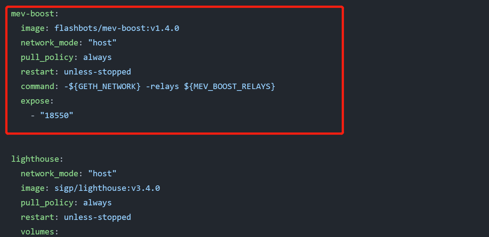
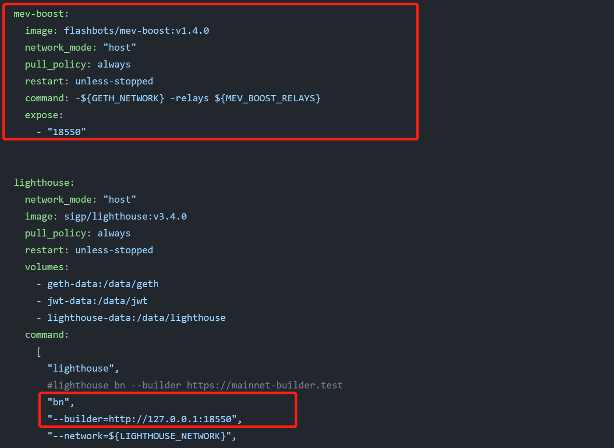
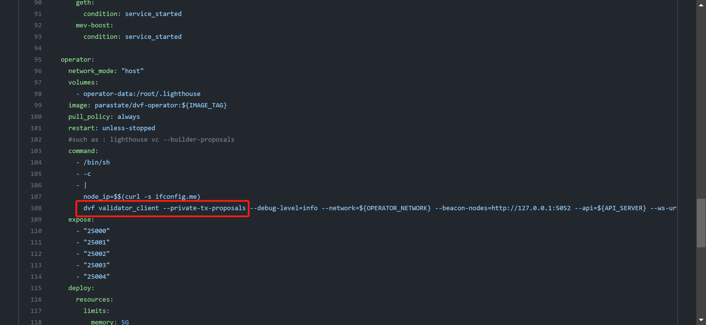
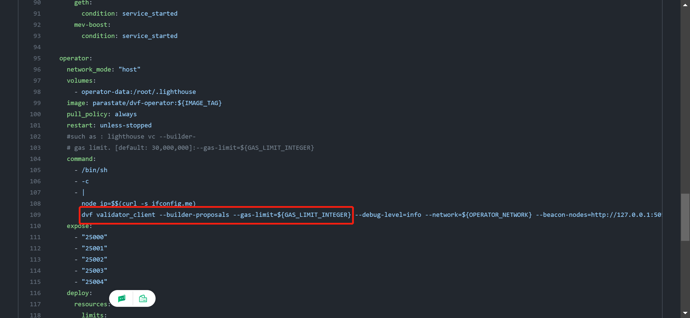

# mev-boost yml description
1 add mev-boost service
```yaml
  mev-boost:
    image: flashbots/mev-boost:v1.4.0
    network_mode: "host"
    pull_policy: always
    restart: unless-stopped
    command: -${GETH_NETWORK} -relays ${MEV_BOOST_RELAYS}
    expose:
      - "18550"
```


2 add mev-boost for lighthouse bn

```"--builder=http://127.0.0.1:18550"```


3 add mev-boost for validator_client 

```--private-tx-proposals/--builder-proposals```


